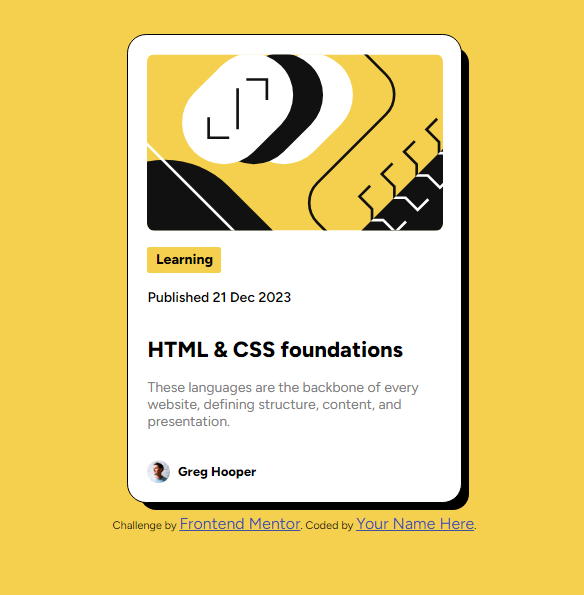

# Frontend Mentor - Blog preview card solution

This is a solution to the [Blog preview card challenge on Frontend Mentor](https://www.frontendmentor.io/challenges/blog-preview-card-ckPaj01IcS). Frontend Mentor challenges help you improve your coding skills by building realistic projects.

## Table of contents

- [Overview](#overview)
  - [The challenge](#the-challenge)
  - [Screenshot](#screenshot)
  - [Links](#links)
- [My process](#my-process)
  - [Built with](#built-with)
  - [What I learned](#what-i-learned)
- [Author](#author)

## Overview

### The challenge

The challenge involved the following tasks:

- Creating specific mixins to control styles more accurately.
- Setting rules for the card to change the title color when hovered.
- Ensuring the width and height are not affected by size changes.

### Screenshot

### Links

- Solution URL: [GitHub - Blog Preview Card Solution](https://github.com/Tre3s-byte/blog-preview-card-main)
- Live Site URL: [Live Site - Blog Preview Card](https://tre3s-byte.github.io/blog-preview-card-main/)

## My process

### Built with

- HTML
- SCSS

### What I learned

I honed my proficiency in SCSS during this project.

## Author

- GitHub: [Tre3s-byte](https://github.com/Tre3s-byte/)
- LinkedIn: [Tre3s-byte on LinkedIn](https://www.linkedin.com/in/tre3s-byte/)
